# Testing Report - pTrack

## Overview

pTrack was tested using multiple complementary strategies: automated unit and integration tests, end-to-end (E2E) browser tests, static analysis and code quality checks, secret scanning, continuous integration automation, production monitoring, and manual cross-device verification. These strategies together cover correctness, robustness, security, performance, and real-world usability across different hardware and software environments.

**Total automated tests: 108**
| Suite | Tool | Count |
|---|---|---|
| Backend unit + integration | pytest | 69 |
| Frontend unit | Vitest | 31 |
| End-to-end (browser) | Playwright / Chromium | 8 |

---

## 1. Backend Unit and Integration Tests (pytest)

**Tool:** pytest 8.x with `pytest-django`, `pytest-cov`
**Database:** Real PostgreSQL 16 container (not mocked) via GitHub Actions service container
**Coverage:** XML report uploaded as CI artifact

### Test modules

| Module | File | Description |
|---|---|---|
| Auth flows | `tests/accounts/test_auth.py` | Registration, login, logout, token refresh, email verification, password reset, Google OAuth, rate limiting |
| User model | `tests/accounts/test_models.py` | Soft delete, hard delete, `all_objects` manager, password hashing |
| Account services | `tests/accounts/test_services.py` | Streak computation, points award, badge unlock logic |
| Waste reports | `tests/reports/test_reports.py` | Report submission, verification, rejection, bulk actions, recycling logging, leaderboard ranking |
| Admin analytics | `tests/core/test_admin.py` | KPI endpoint, reports-over-time, by-sector, by-type, top-users, heatmap, engagement funnel |
| Notifications | `tests/core/test_notifications.py` | Notification creation, mark-read, delete, inbox listing |

### Sample edge cases tested

- Duplicate registration with the same email (expected 400)
- Login with wrong credentials (expected 401)
- Brute-force lockout: 5 failed logins trigger a 15-minute IP lockout via django-axes
- Token refresh after logout (blacklisted token, expected 401)
- Report verification awards the configured bonus points to the submitting citizen
- Badge unlock is idempotent — submitting the same points event twice does not double-award
- Soft-deleted users are excluded from all default ORM querysets; `all_objects` retrieves them
- Leaderboard excludes users who have disabled `show_on_leaderboard`

### Running locally

```bash
cd backend
pytest --cov=. --cov-report=term-missing
```
NB: Ensure venv is installed, activated, and all packages installed.
---

## 2. Frontend Unit Tests (Vitest)

**Tool:** Vitest 3.x with `@testing-library/react`, `@testing-library/user-event`, v8 coverage
**Coverage:** HTML report uploaded as CI artifact

### Test modules

| Module | File | Description |
|---|---|---|
| Auth store | `test/stores/authStore.test.ts` | Login state, token storage, logout clears state |
| Theme store | `test/stores/themeStore.test.ts` | Light / dark / system mode transitions, localStorage persistence |
| Sectors utility | `test/lib/sectors.test.ts` | Sector list completeness, lookup helpers |
| Login page | `test/pages/Login.test.tsx` | Form validation, error display, submit triggers auth call |
| ScrollToTop | `test/components/ScrollToTop.test.tsx` | Scroll resets on route change |
| UpdateBanner | `test/components/UpdateBanner.test.tsx` | Service worker update prompt appears and triggers reload |

### Running locally

```bash
cd frontend
npm test              # watch mode
npm test -- --run     # single pass
npm test -- --run --coverage  # with coverage report
```

---

## 3. End-to-End Tests (Playwright — Chromium)

**Tool:** Playwright 1.x
**Browser:** Chromium (Desktop Chrome device profile)
**Environment:** Full stack — Django backend on port 8000, Vite production build served by `npx serve --single` on port 5173
**Backend database:** PostgreSQL 16 container with migrations applied

### Spec files

| Spec | File | Scenario |
|---|---|---|
| Landing -> login | `e2e/01-landing-to-login.spec.ts` | Unauthenticated user is redirected from dashboard to login; can log in and reach dashboard |
| Submit waste report | `e2e/02-submit-report.spec.ts` | Citizen submits a waste report; report appears in the list and on the map |
| Theme and language | `e2e/03-theme-language-persist.spec.ts` | Dark mode toggle persists after page reload; language switches to Kinyarwanda and back |
| Admin verify report | `e2e/04-admin-verify-report.spec.ts` | Admin logs in, opens a pending report, verifies it; citizen's points increase |
| Offline report queue | `e2e/05-offline-report-queue.spec.ts` | Browser goes offline (service worker blocked), report is queued in IndexedDB, syncs on reconnect |

### Running locally

```bash
cd frontend
npx playwright test                      # headless
npx playwright test --headed             # watch in browser
npx playwright show-report               # HTML report after run
```

### CI evidence

The E2E job in `.github/workflows/ci.yml` depends on `frontend-quality` and `backend-test` passing. On completion it uploads the Playwright HTML report as a GitHub Actions artifact (`playwright-report`) retained for 30 days. CI badge is visible in the README.

---

## 4. Code Quality and Static Analysis

All checks run automatically in CI and are required to pass before any merge to `main` or `develop`.

### Frontend

| Check | Tool | Command |
|---|---|---|
| Type checking | TypeScript 6.0.3 (`tsc --noEmit`) | `npm run typecheck` |
| Linting | ESLint 9 (flat config) | `npm run lint` |
| Formatting | Prettier 3 | `npm run format:check` |
| Production build | Vite 8 | `npm run build` |

### Backend

| Check | Tool | Command |
|---|---|---|
| Linting | Ruff 0.12 | `ruff check .` |
| Formatting | Black 25 | `black --check .` |
| Type checking | mypy 1.16 | `mypy . --exclude venv` |

All tool configuration lives in `backend/pyproject.toml` and `frontend/eslint.config.js`.

---

## 5. Security Scanning

**Tool:** Gitleaks v8 via `gitleaks/gitleaks-action@v3`
**Scope:** Full git history (`fetch-depth: 0`) on every push and PR to `main` / `develop`

Gitleaks scans for accidentally committed secrets - API keys, tokens, passwords. Findings are reported as GitHub Security events. No secrets have been detected in the repository history.

**Additional security measures verified in testing:**
- Argon2 password hashing confirmed via Django `PASSWORD_HASHERS` setting
- JWT token blacklist confirmed (logout invalidates refresh token; re-use returns 401)
- Brute-force lockout confirmed: 5 consecutive failed logins lock the IP for 15 minutes (django-axes)
- HTTP security headers (HSTS, CSP, X-Frame-Options, Referrer-Policy) verified via `curl -I` on the production backend

---

## 6. CI/CD Pipeline

**Tool:** GitHub Actions
**Triggers:** Every push and PR to `main` and `develop`

| Job | Runner | What it verifies |
|---|---|---|
| `frontend-quality` | ubuntu-24.04 | TypeScript types, ESLint, Prettier, Vite build |
| `frontend-test` | ubuntu-24.04 | 31 Vitest unit tests with v8 coverage |
| `backend-quality` | ubuntu-24.04 | Ruff, Black, mypy |
| `backend-test` | ubuntu-24.04 | 69 pytest tests against PostgreSQL 16 |
| `e2e` | ubuntu-24.04 | 8 Playwright tests (full stack, Chromium) |
| `secrets-scan` | ubuntu-24.04 | Gitleaks across full git history |

The `e2e` job has a `needs: [frontend-quality, backend-test]` dependency - it only runs when the simpler jobs pass. All 6 jobs must pass for a green commit status.

CodeQL security analysis runs weekly and on every PR to `main`.

**Screenshot reference:** `docs/screenshots/ci-passing.png` — CI pipeline with all 6 jobs green.

---

## 7. Production Monitoring

### Sentry (Error and Performance Monitoring)

- **Frontend:** `@sentry/react 10.62.0` — captures uncaught exceptions, React error boundaries, and performance traces
- **Backend:** `sentry-sdk 2.63.0` — captures Django exceptions, slow database queries, and request traces
- Both are configured with environment tags (`production` / `development`) so staging noise is filtered

### UptimeRobot (Availability Monitoring)

- **Health endpoint (Backend):** `GET /api/v1/health/` returns `{"status": "ok", "database": "ok", "cache": "ok"}`
- **HEAD support:** The health endpoint explicitly allows `HEAD` requests (`@api_view(["GET", "HEAD"])`) so UptimeRobot's default HEAD checks succeed
- **Result:** 100% uptime (Backend + Frontend). An earlier recording of ~94.181% was due to UptimeRobot using `HEAD` requests which the health endpoint initially rejected; that was resolved by adding `HEAD` to the allowed methods.

---

## 8. Cross-Device and Cross-Platform Testing

pTrack was tested as an installed Progressive Web App (PWA) and as a mobile browser experience across the following devices:

| Device | OS | Browser | Mode | Result |
|---|---|---|---|---|
| Techno Camon 20 Pro, 256 GB Storage, 8/16 RAM, 4G Network (Android) | Android 14 | Chrome | PWA installed on home screen | Pass |
| Google Pixel 6 Pro, 128 GB Storage, 12 GB RAM, LTE Network (Android) | Android 16 | Chrome | PWA installed on home screen | Pass |
| iPhone 14 Pro Max, 256 GB Storage, 6 GB, LTE/5G Network (iOS) | iOS 26.5 | Safari | Add to Home Screen (A2HS) | Pass |
| iPhone 11 Pro Max, 256 GB Storage, 6 GB, LTE Network (iOS) | iOS 18.6.2 | Chrome | Add to Home Screen (A2HS) | Pass |
| MacBook Pro, 512 SSD, 16 GB RAM, 1.7 GHz Quad-Core Intel Core i7 | macOS Sequoia 15.7.7 | Chrome | Desktop PWA | Pass |
| MacBook Pro, 512 SSD, 16 GB RAM, 1.7 GHz Quad-Core Intel Core i7 | macOS Sequoia 15.7.7 | Firefox | Browser tab | Pass |
| Windows 11 Pro, 512 SSD, 12 GB RAM, 11th Gen Intel(R) Core i5 | 10.0.22631 Build 22631 | Chrome | Desktop PWA | Pass |

### Observations

- **PWA installation:** The install prompt appeared automatically on Chrome for Android. On iOS Safari, the manual Add to Home Screen flow was used (Web Push is not supported on iOS Safari; the app gracefully disables push notification prompts on iOS).
- **Offline mode:** After installing the PWA on Android, switching to airplane mode showed the cached dashboard, leaderboard, and recent reports. A waste report submitted in offline mode was queued in IndexedDB; on reconnect, the background sync replayed it and the report appeared in the list.
- **Responsive layout:** All core pages (dashboard, map, leaderboard, profile, admin dashboard) rendered correctly at mobile widths (360 px) and desktop widths (1440 px). The citizen-facing side is optimised for mobile, while the admin dashboard is optimised for laptop/desktop
- **Dark mode:** Correct on all devices; system theme is respected by default.

---

## 9. Different Data Values Tested

| Scenario | Input variation | Expected behaviour | Verified |
|---|---|---|---|
| Waste report - all waste types | Plastic bottles, plastic bags, mixed plastic, other | Report saved with correct type; map pin colour matches | Yes |
| Waste report - photo upload | JPEG, PNG (required) | JPEG and PNG accepted; form validation rejects submission without a photo | Yes |
| Waste report - offline | No network | Queued in IndexedDB; syncs on reconnect | Yes |
| Points award | Report submitted (x pts), verified (+bonus pts), recycling logged | Points total increments correctly after each event | Yes |
| Badge unlock | Points crossing threshold for each badge tier | Badge awarded once at threshold; not re-awarded | Yes |
| Leaderboard - privacy | User with `show_on_leaderboard = false` | Excluded from leaderboard list | Yes |
| Admin bulk verify | 1 report, 5 reports, 20 reports | All verified in one request; points distributed | Yes |
| Password reset | Correct email, non-existent email | Correct: code sent; non-existent: same success response (no email enumeration) | Yes |
| Rate limiting | >10 requests/minute to public endpoints | 429 Too Many Requests returned | Yes |

---

## 10. Evidence Screenshots

### CI/CD Pipeline

<table>
  <tr>
    <td>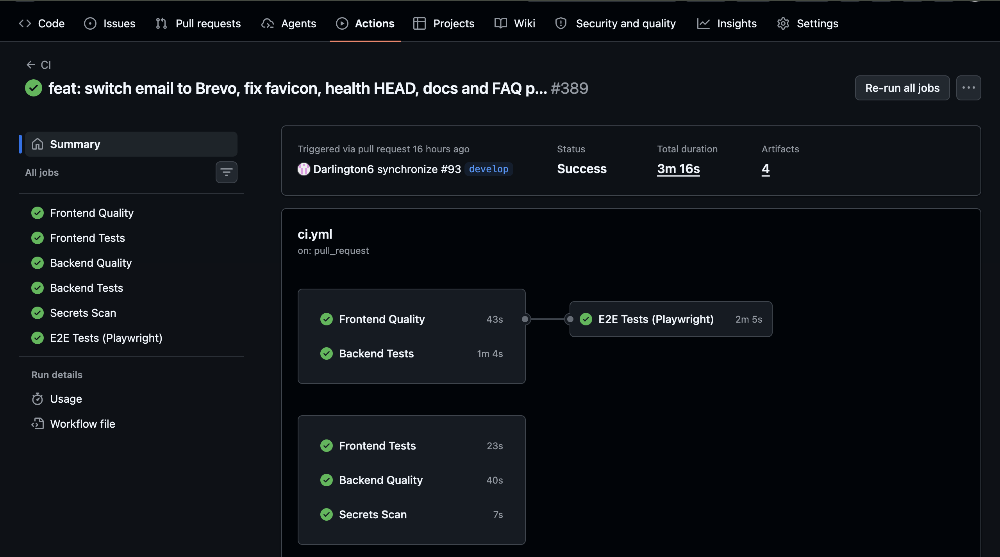</td>
  </tr>
  <tr>
    <td align="center">CI pipeline — all 6 jobs green (frontend-quality, frontend-test, backend-quality, backend-test, e2e, secrets-scan)</td>
  </tr>
</table>

### Backend Tests (pytest)

<table>
  <tr>
    <td>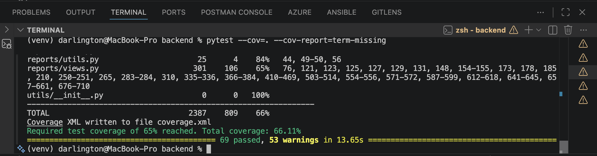</td>
  </tr>
  <tr>
    <td align="center">pytest — 69 tests passing with coverage report</td>
  </tr>
</table>

### Frontend Tests (Vitest)

<table>
  <tr>
    <td>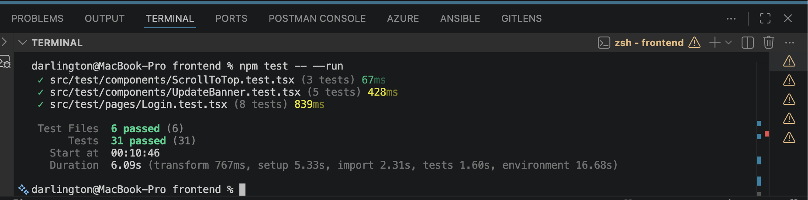</td>
  </tr>
  <tr>
    <td align="center">Vitest — 31 unit tests passing</td>
  </tr>
</table>

### End-to-End Tests (Playwright)

<table>
  <tr>
    <td>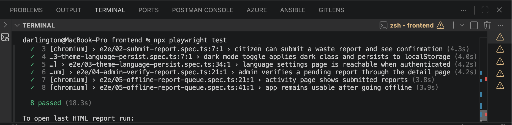</td>
    <td>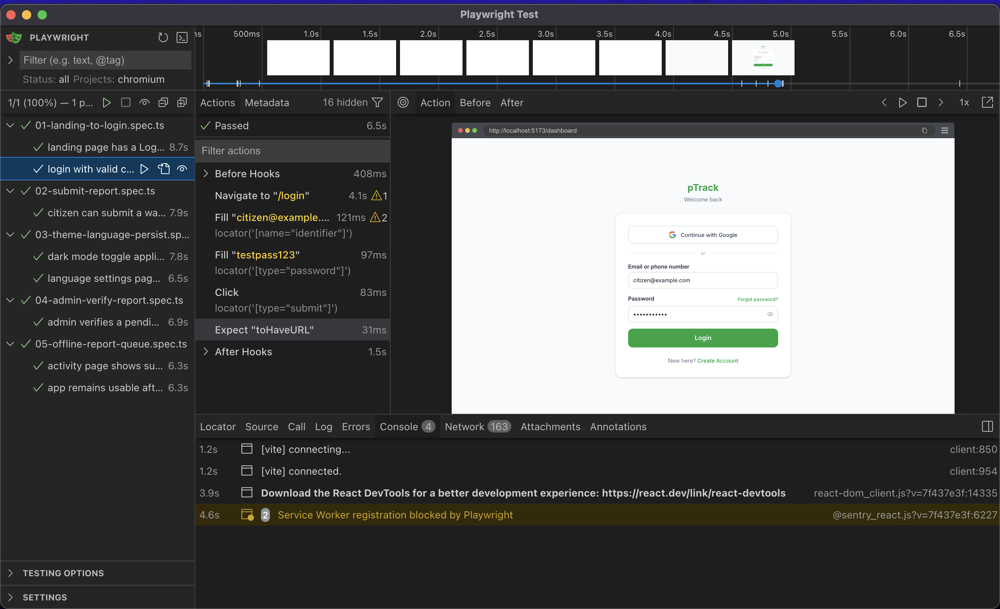</td>
  </tr>
  <tr>
    <td align="center">Playwright headless run — 8 tests passing</td>
    <td align="center">Playwright <code>--ui</code> interactive mode</td>
  </tr>
</table>

<table>
  <tr>
    <td>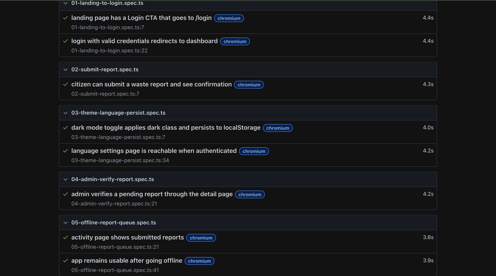</td>
  </tr>
  <tr>
    <td align="center">Playwright HTML report</td>
  </tr>
</table>

### Production Monitoring (UptimeRobot)

<table>
  <tr>
    <td>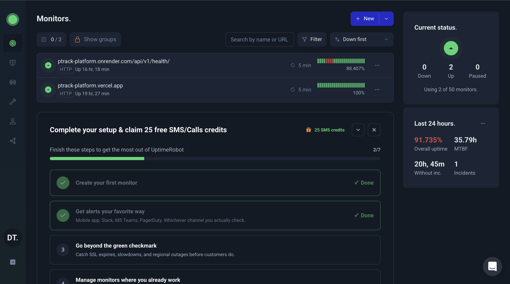</td>
  </tr>
  <tr>
    <td align="center">UptimeRobot — backend and frontend availability monitors at 100%</td>
  </tr>
</table>

### App Screens — Mobile (Android & iOS)

<table>
  <tr>
    <td>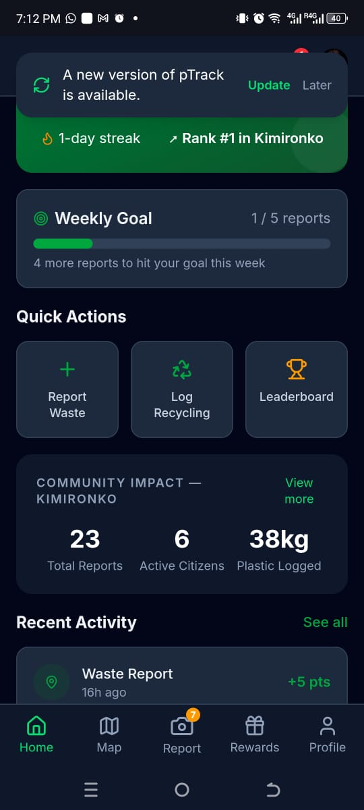</td>
    <td>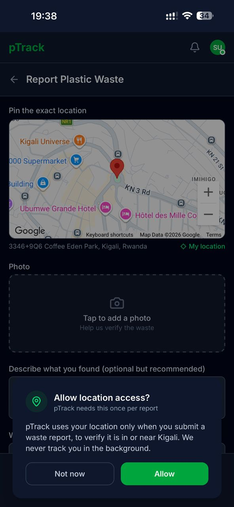</td>
    <td>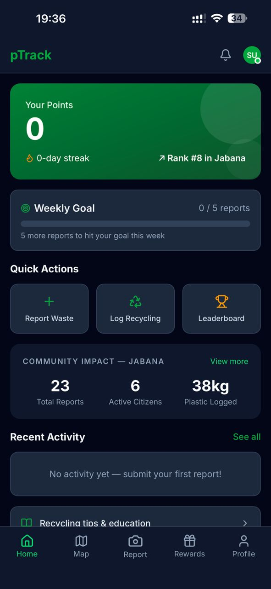</td>
  </tr>
  <tr>
    <td align="center">pTrack on Android (Techno Camon)</td>
    <td align="center">pTrack on iPhone (iOS Safari)</td>
    <td align="center">Citizen dashboard</td>
  </tr>
</table>

<table>
  <tr>
    <td>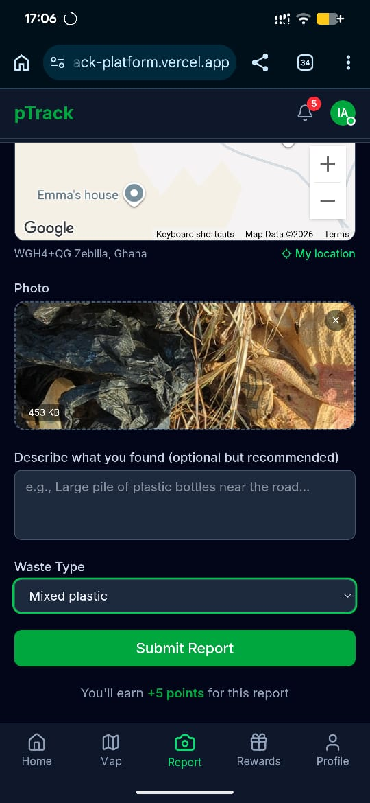</td>
    <td>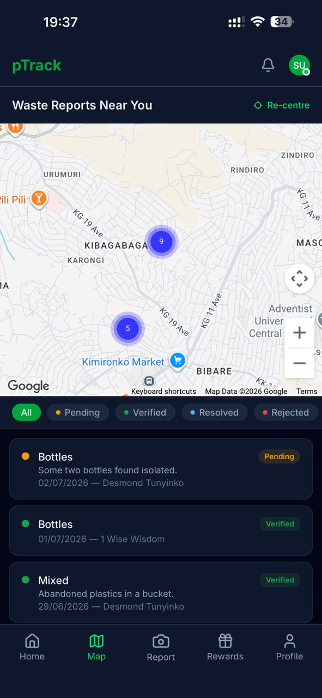</td>
    <td>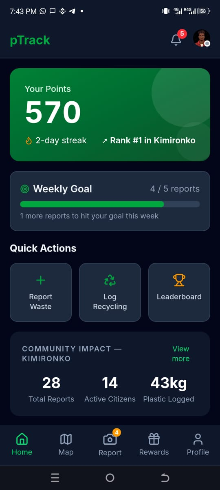</td>
  </tr>
  <tr>
    <td align="center">Waste report submission</td>
    <td align="center">Interactive waste report map</td>
    <td align="center">PWA offline mode (queued report)</td>
  </tr>
</table>

<table>
  <tr>
    <td>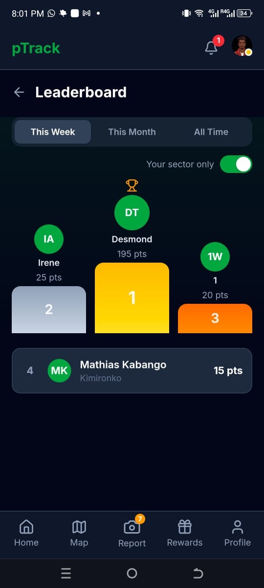</td>
    <td>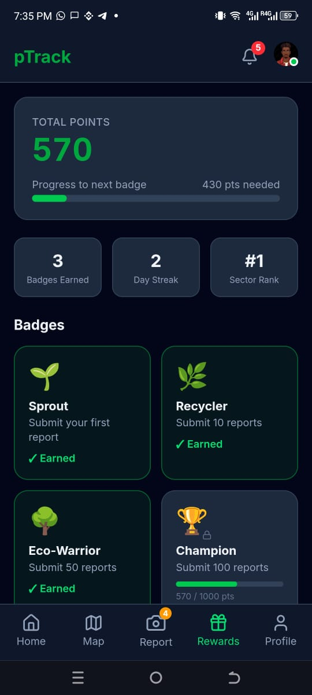</td>
    <td>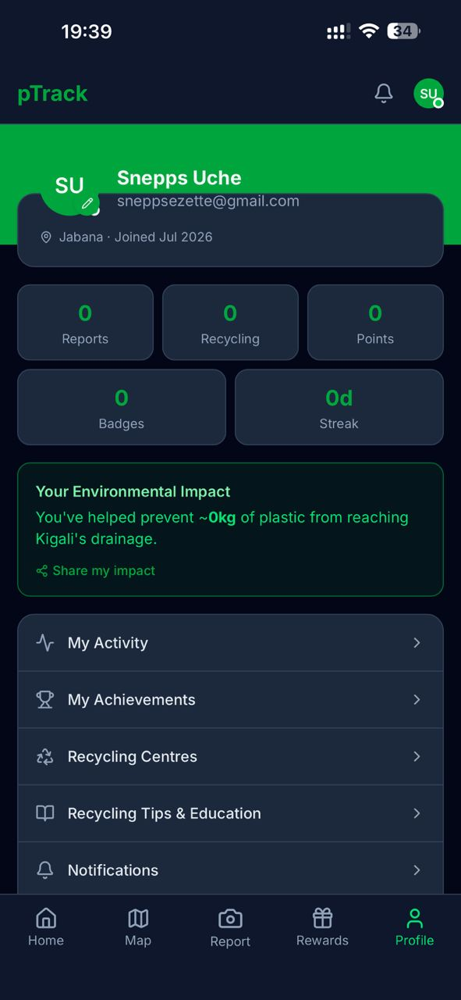</td>
  </tr>
  <tr>
    <td align="center">Community leaderboard</td>
    <td align="center">Badges and rewards</td>
    <td align="center">User profile</td>
  </tr>
</table>

### Admin Interface (Desktop)

<table>
  <tr>
    <td>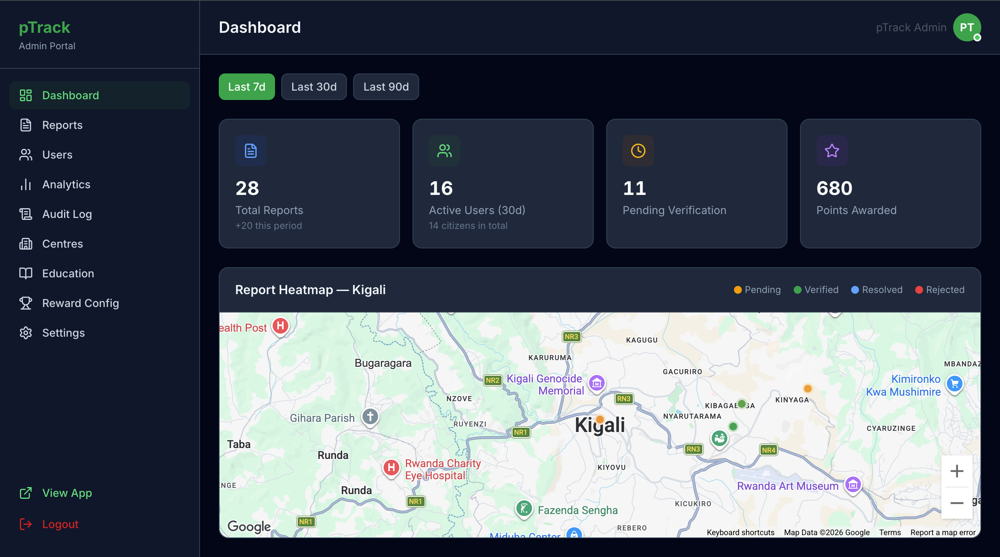</td>
    <td>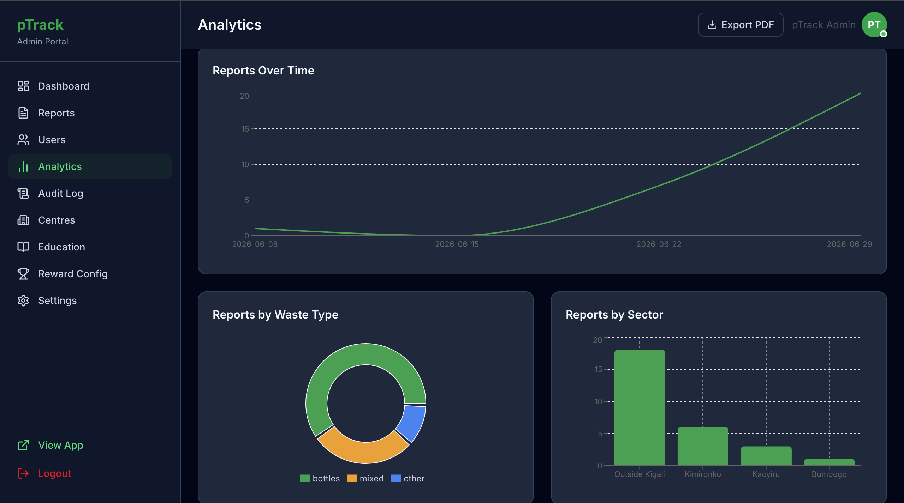</td>
  </tr>
  <tr>
    <td align="center">Admin dashboard — KPI cards and report management</td>
    <td align="center">Admin analytics — charts and engagement funnel</td>
  </tr>
</table>

---

## 11. Summary

| Strategy | Status |
|---|---|
| Backend unit + integration tests (69) | Passing in CI |
| Frontend unit tests (31) | Passing in CI |
| E2E browser tests (8, Chromium) | Passing in CI |
| TypeScript / mypy type checking | Passing in CI |
| ESLint / Ruff linting | Passing in CI |
| Black / Prettier formatting | Passing in CI |
| Gitleaks secret scan | No findings |
| Production uptime (UptimeRobot) | 100% (backend + frontend) |
| Sentry error monitoring | Active, zero unresolved errors |
| Cross-device testing (5+ device types) | All pass |
| Offline PWA (IndexedDB + background sync) | Verified on Android, iPhone, and MacBook |

All automated checks pass on every commit to `main`. The live deployment at `https://ptrack-platform.vercel.app` has been manually verified to match the expected behaviour described in this report.