# Testing Report - pTrack

## Overview

pTrack was tested using multiple complementary strategies: automated unit and integration tests, end-to-end (E2E) browser tests, static analysis and code quality checks, secret scanning, continuous integration automation, production monitoring, and manual cross-device verification. These strategies together cover correctness, robustness, security, performance, and real-world usability across different hardware and software environments.

**Total automated tests: 145**
| Suite | Tool | Count |
|---|---|---|
| Backend unit + integration | pytest | 106 |
| Frontend unit | Vitest | 31 |
| End-to-end (browser) | Playwright / Chromium | 8 |

---

## 1. Backend Unit and Integration Tests (pytest)

**Tool:** pytest 8.x with `pytest-django`, `pytest-cov`
**Database:** Real PostgreSQL 16 container (not mocked) via GitHub Actions service container
**Coverage:** XML report uploaded as CI artifact

### Test modules

| Module | File | Description |
|---|---|---|
| Auth flows | `tests/accounts/test_auth.py` | Registration, login, logout, token refresh, email verification, password reset, Google OAuth, rate limiting |
| User model | `tests/accounts/test_models.py` | Soft delete, hard delete, `all_objects` manager, password hashing |
| Account services | `tests/accounts/test_services.py` | Streak computation, points award, badge unlock logic |
| Waste reports | `tests/reports/test_reports.py` | Report submission, verification, rejection, bulk actions, recycling logging, leaderboard ranking |
| Admin analytics | `tests/core/test_admin.py` | KPI endpoint, reports-over-time, by-sector, by-type, top-users, heatmap, engagement funnel |
| Notifications | `tests/core/test_notifications.py` | Notification creation, mark-read, delete, inbox listing |
| AI image analysis | `tests/reports/test_ai_service.py` | Gemini integration, LRU cache behaviour, image validity rejection, waste-type classification (4 types), priority scoring P1–P5, bilingual description generation, model fallback on 404/429, markdown fence stripping |
| Fraud detection | `tests/reports/test_fraud_detector.py` | Duplicate image MD5 hash, location proximity (Haversine 50 m / 24 h window), high-velocity >5 reports/hr, `pre_check()` and post-save `check()`, `flag_reasons` population |

### Sample edge cases tested

- Duplicate registration with the same email (expected 400)
- Login with wrong credentials (expected 401)
- Brute-force lockout: 5 failed logins trigger a 15-minute IP lockout via django-axes
- Token refresh after logout (blacklisted token, expected 401)
- Report verification awards the configured bonus points to the submitting citizen
- Badge unlock is idempotent — submitting the same points event twice does not double-award
- Soft-deleted users are excluded from all default ORM querysets; `all_objects` retrieves them
- Leaderboard excludes users who have disabled `show_on_leaderboard`

### Running locally

```bash
cd backend
pytest --cov=. --cov-report=term-missing
```
NB: Ensure venv is installed, activated, and all packages installed.
---

## 2. Frontend Unit Tests (Vitest)

**Tool:** Vitest 3.x with `@testing-library/react`, `@testing-library/user-event`, v8 coverage
**Coverage:** HTML report uploaded as CI artifact

### Test modules

| Module | File | Description |
|---|---|---|
| Auth store | `test/stores/authStore.test.ts` | Login state, token storage, logout clears state |
| Theme store | `test/stores/themeStore.test.ts` | Light / dark / system mode transitions, localStorage persistence |
| Sectors utility | `test/lib/sectors.test.ts` | Sector list completeness, lookup helpers |
| Login page | `test/pages/Login.test.tsx` | Form validation, error display, submit triggers auth call |
| ScrollToTop | `test/components/ScrollToTop.test.tsx` | Scroll resets on route change |
| UpdateBanner | `test/components/UpdateBanner.test.tsx` | Service worker update prompt appears and triggers reload |

### Running locally

```bash
cd frontend
npm test              # watch mode
npm test -- --run     # single pass
npm test -- --run --coverage  # with coverage report
```

---

## 3. End-to-End Tests (Playwright — Chromium)

**Tool:** Playwright 1.x
**Browser:** Chromium (Desktop Chrome device profile)
**Environment:** Full stack — Django backend on port 8000, Vite production build served by `npx serve --single` on port 5173
**Backend database:** PostgreSQL 16 container with migrations applied

### Spec files

| Spec | File | Scenario |
|---|---|---|
| Landing -> login | `e2e/01-landing-to-login.spec.ts` | Unauthenticated user is redirected from dashboard to login; can log in and reach dashboard |
| Submit waste report | `e2e/02-submit-report.spec.ts` | Citizen submits a waste report; report appears in the list and on the map |
| Theme and language | `e2e/03-theme-language-persist.spec.ts` | Dark mode toggle persists after page reload; language switches to Kinyarwanda and back |
| Admin verify report | `e2e/04-admin-verify-report.spec.ts` | Admin logs in, opens a pending report, verifies it; citizen's points increase |
| Offline report queue | `e2e/05-offline-report-queue.spec.ts` | Browser goes offline (service worker blocked), report is queued in IndexedDB, syncs on reconnect |

### Running locally

```bash
cd frontend
npx playwright test                      # headless
npx playwright test --headed             # watch in browser
npx playwright show-report               # HTML report after run
```

### CI evidence

The E2E job in `.github/workflows/ci.yml` depends on `frontend-quality` and `backend-test` passing. On completion it uploads the Playwright HTML report as a GitHub Actions artifact (`playwright-report`) retained for 30 days. CI badge is visible in the README.

---

## 4. Code Quality and Static Analysis

All checks run automatically in CI and are required to pass before any merge to `main` or `develop`.

### Frontend

| Check | Tool | Command |
|---|---|---|
| Type checking | TypeScript 6.0.3 (`tsc --noEmit`) | `npm run typecheck` |
| Linting | ESLint 9 (flat config) | `npm run lint` |
| Formatting | Prettier 3 | `npm run format:check` |
| Production build | Vite 8 | `npm run build` |

### Backend

| Check | Tool | Command |
|---|---|---|
| Linting | Ruff 0.12 | `ruff check .` |
| Formatting | Black 25 | `black --check .` |
| Type checking | mypy 1.16 | `mypy . --exclude venv` |

All tool configuration lives in `backend/pyproject.toml` and `frontend/eslint.config.js`.

---

## 5. Security Scanning

**Tool:** Gitleaks v8 via `gitleaks/gitleaks-action@v3`
**Scope:** Full git history (`fetch-depth: 0`) on every push and PR to `main` / `develop`

Gitleaks scans for accidentally committed secrets - API keys, tokens, passwords. Findings are reported as GitHub Security events. No secrets have been detected in the repository history.

**Additional security measures verified in testing:**
- Argon2 password hashing confirmed via Django `PASSWORD_HASHERS` setting
- JWT token blacklist confirmed (logout invalidates refresh token; re-use returns 401)
- Brute-force lockout confirmed: 5 consecutive failed logins lock the IP for 15 minutes (django-axes)
- HTTP security headers (HSTS, CSP, X-Frame-Options, Referrer-Policy) verified via `curl -I` on the production backend

---

## 6. CI/CD Pipeline

**Tool:** GitHub Actions
**Triggers:** Every push and PR to `main` and `develop`

| Job | Runner | What it verifies |
|---|---|---|
| `frontend-quality` | ubuntu-24.04 | TypeScript types, ESLint, Prettier, Vite build |
| `frontend-test` | ubuntu-24.04 | 31 Vitest unit tests with v8 coverage |
| `backend-quality` | ubuntu-24.04 | Ruff, Black, mypy |
| `backend-test` | ubuntu-24.04 | 106 pytest tests against PostgreSQL 16 |
| `e2e` | ubuntu-24.04 | 8 Playwright tests (full stack, Chromium) |
| `secrets-scan` | ubuntu-24.04 | Gitleaks across full git history |

The `e2e` job has a `needs: [frontend-quality, backend-test]` dependency - it only runs when the simpler jobs pass. All 6 jobs must pass for a green commit status.

CodeQL security analysis runs weekly and on every PR to `main`.

**Screenshot reference:** `docs/screenshots/ci-passing.png` — CI pipeline with all 6 jobs green.

---

## 7. Production Monitoring

### Sentry (Error and Performance Monitoring)

- **Frontend:** `@sentry/react 10.62.0` — captures uncaught exceptions, React error boundaries, and performance traces
- **Backend:** `sentry-sdk 2.63.0` — captures Django exceptions, slow database queries, and request traces
- Both are configured with environment tags (`production` / `development`) so staging noise is filtered

### UptimeRobot (Availability Monitoring)

- **Health endpoint (Backend):** `GET /api/v1/health/` returns `{"status": "ok", "database": "ok", "cache": "ok"}`
- **HEAD support:** The health endpoint explicitly allows `HEAD` requests (`@api_view(["GET", "HEAD"])`) so UptimeRobot's default HEAD checks succeed
- **Result:** 100% uptime (Backend + Frontend). An earlier recording of ~94.181% was due to UptimeRobot using `HEAD` requests which the health endpoint initially rejected; that was resolved by adding `HEAD` to the allowed methods.

---

## 8. Cross-Device and Cross-Platform Testing

pTrack was tested as an installed Progressive Web App (PWA) and as a mobile browser experience across the following devices:

| Device | OS | Browser | Mode | Result |
|---|---|---|---|---|
| Techno Camon 20 Pro, 256 GB Storage, 8/16 RAM, 4G Network (Android) | Android 14 | Chrome | PWA installed on home screen | Pass |
| Google Pixel 6 Pro, 128 GB Storage, 12 GB RAM, LTE Network (Android) | Android 16 | Chrome | PWA installed on home screen | Pass |
| iPhone 14 Pro Max, 256 GB Storage, 6 GB, LTE/5G Network (iOS) | iOS 26.5 | Safari | Add to Home Screen (A2HS) | Pass |
| iPhone 11 Pro Max, 256 GB Storage, 6 GB, LTE Network (iOS) | iOS 18.6.2 | Chrome | Add to Home Screen (A2HS) | Pass |
| MacBook Pro, 512 SSD, 16 GB RAM, 1.7 GHz Quad-Core Intel Core i7 | macOS Sequoia 15.7.7 | Chrome | Desktop PWA | Pass |
| MacBook Pro, 512 SSD, 16 GB RAM, 1.7 GHz Quad-Core Intel Core i7 | macOS Sequoia 15.7.7 | Firefox | Browser tab | Pass |
| Windows 11 Pro, 512 SSD, 12 GB RAM, 11th Gen Intel(R) Core i5 | 10.0.22631 Build 22631 | Chrome | Desktop PWA | Pass |

### Observations

- **PWA installation:** The install prompt appeared automatically on Chrome for Android. On iOS Safari, the manual Add to Home Screen flow was used (Web Push is not supported on iOS Safari; the app gracefully disables push notification prompts on iOS).
- **Offline mode:** After installing the PWA on Android, switching to airplane mode showed the cached dashboard, leaderboard, and recent reports. A waste report submitted in offline mode was queued in IndexedDB; on reconnect, the background sync replayed it and the report appeared in the list.
- **Responsive layout:** All core pages (dashboard, map, leaderboard, profile, admin dashboard) rendered correctly at mobile widths (360 px) and desktop widths (1440 px). The citizen-facing side is optimised for mobile, while the admin dashboard is optimised for laptop/desktop
- **Dark mode:** Correct on all devices; system theme is respected by default.

---

## 9. Different Data Values Tested

| Scenario | Input variation | Expected behaviour | Verified |
|---|---|---|---|
| Waste report - all waste types | Plastic bottles, plastic bags, mixed plastic, other | Report saved with correct type; map pin colour matches | Yes |
| Waste report - photo upload | JPEG, PNG (required) | JPEG and PNG accepted; form validation rejects submission without a photo | Yes |
| Waste report - offline | No network | Queued in IndexedDB; syncs on reconnect | Yes |
| Points award | Report submitted (x pts), verified (+bonus pts), recycling logged | Points total increments correctly after each event | Yes |
| Badge unlock | Points crossing threshold for each badge tier | Badge awarded once at threshold; not re-awarded | Yes |
| Leaderboard - privacy | User with `show_on_leaderboard = false` | Excluded from leaderboard list | Yes |
| Admin bulk verify | 1 report, 5 reports, 20 reports | All verified in one request; points distributed | Yes |
| Password reset | Correct email, non-existent email | Correct: code sent; non-existent: same success response (no email enumeration) | Yes |
| Rate limiting | >10 requests/minute to public endpoints | 429 Too Many Requests returned | Yes |

---

## 10. Evidence Screenshots

### CI/CD Pipeline

<table>
  <tr>
    <td>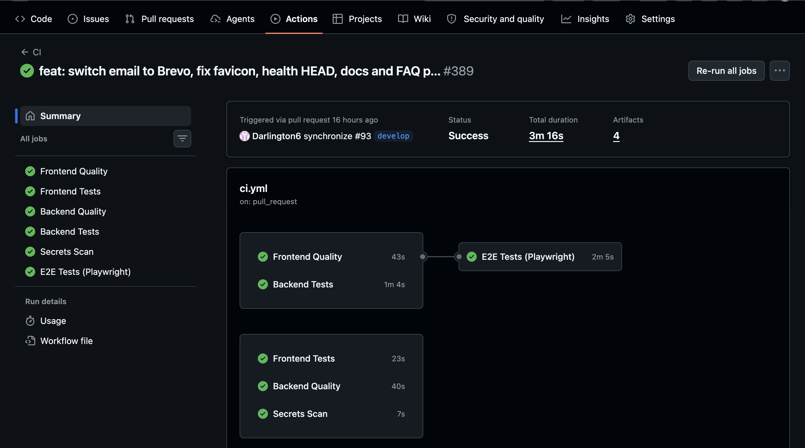</td>
  </tr>
  <tr>
    <td align="center">CI pipeline — all 6 jobs green (frontend-quality, frontend-test, backend-quality, backend-test, e2e, secrets-scan)</td>
  </tr>
</table>

### Backend Tests (pytest)

<table>
  <tr>
    <td>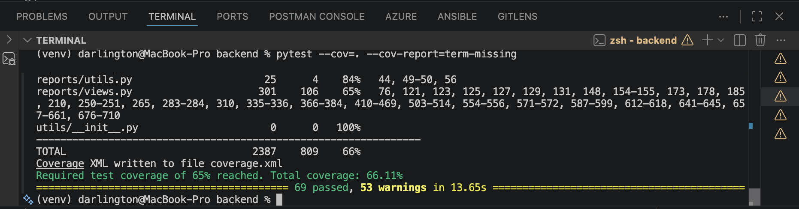</td>
  </tr>
  <tr>
    <td align="center">pytest — 106 tests passing with coverage report</td>
  </tr>
</table>

### Frontend Tests (Vitest)

<table>
  <tr>
    <td>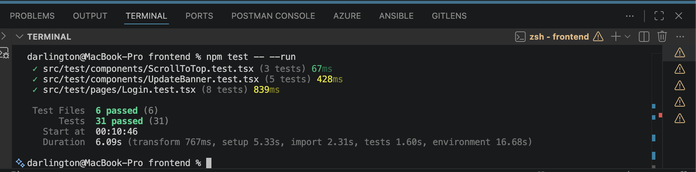</td>
  </tr>
  <tr>
    <td align="center">Vitest — 31 unit tests passing</td>
  </tr>
</table>

### End-to-End Tests (Playwright)

<table>
  <tr>
    <td>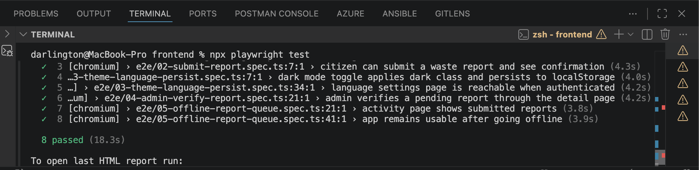</td>
    <td>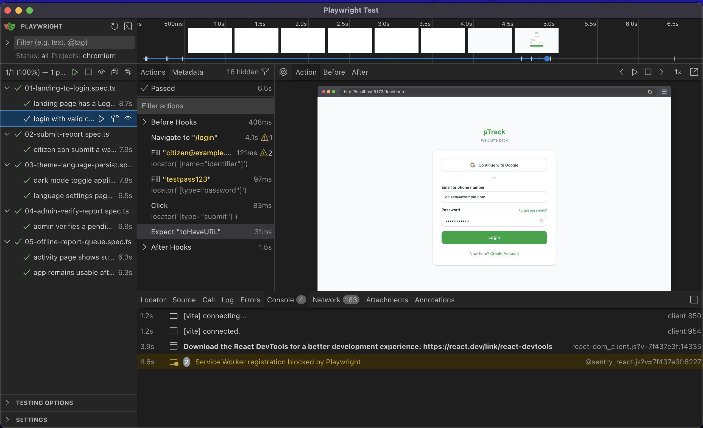</td>
  </tr>
  <tr>
    <td align="center">Playwright headless run — 8 tests passing</td>
    <td align="center">Playwright <code>--ui</code> interactive mode</td>
  </tr>
</table>

<table>
  <tr>
    <td>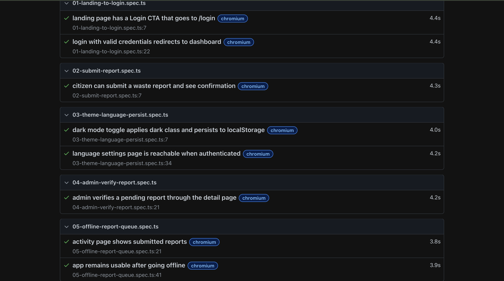</td>
  </tr>
  <tr>
    <td align="center">Playwright HTML report</td>
  </tr>
</table>

### Production Monitoring (UptimeRobot)

<table>
  <tr>
    <td>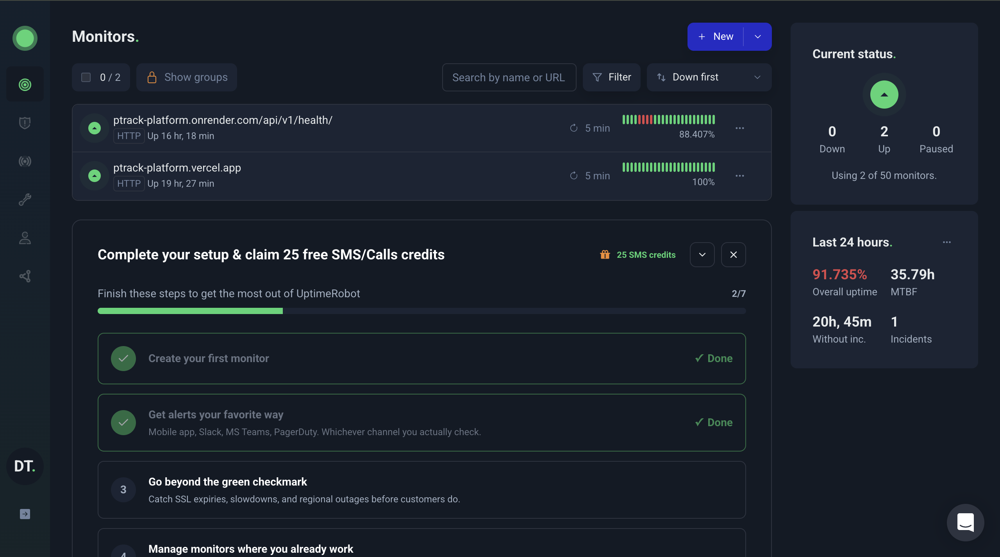</td>
    <td>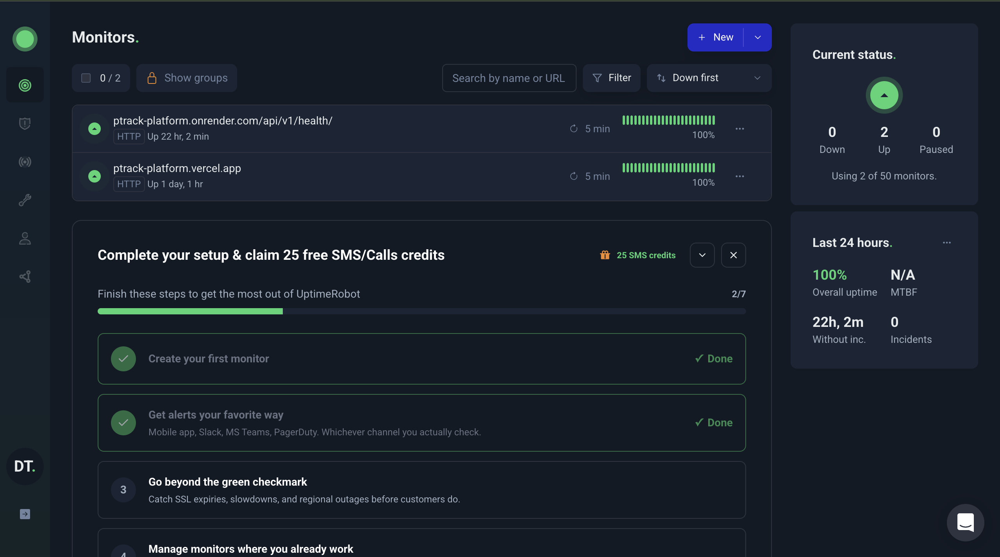</td>
  </tr>
  <tr>
    <td align="center">UptimeRobot — backend and frontend availability monitors at 100% and 88.407% respectively</td>
    <td align="center">UptimeRobot — backend and frontend availability monitors at 100% each</td>
  </tr>
</table>

### App Screens — Mobile (Android & iOS)

<table>
  <tr>
    <td>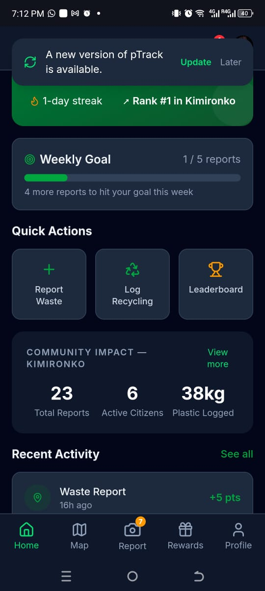</td>
    <td>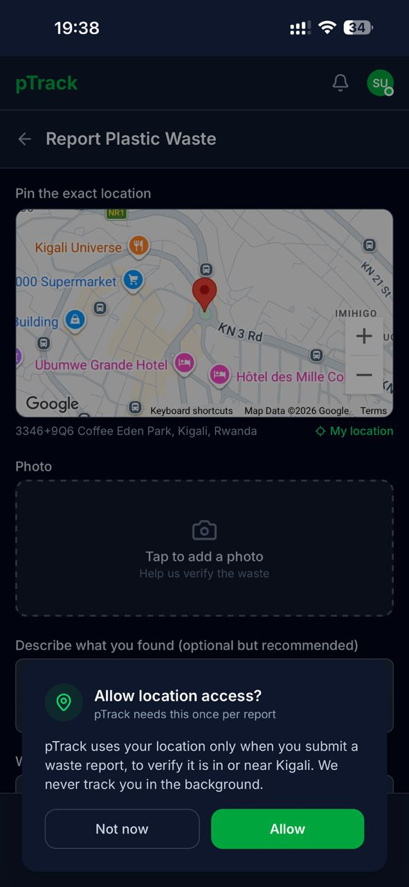</td>
    <td>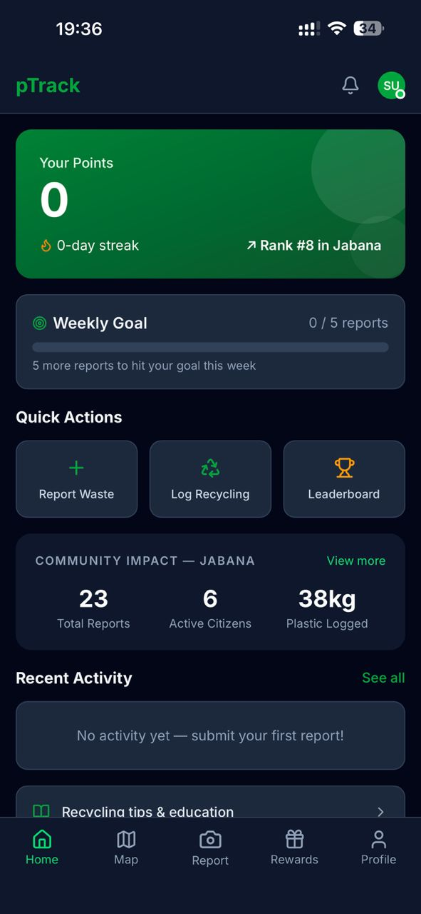</td>
  </tr>
  <tr>
    <td align="center">pTrack on Android (Techno Camon)</td>
    <td align="center">pTrack on iPhone (PWA)</td>
    <td align="center">Citizen dashboard</td>
  </tr>
</table>

<table>
  <tr>
    <td>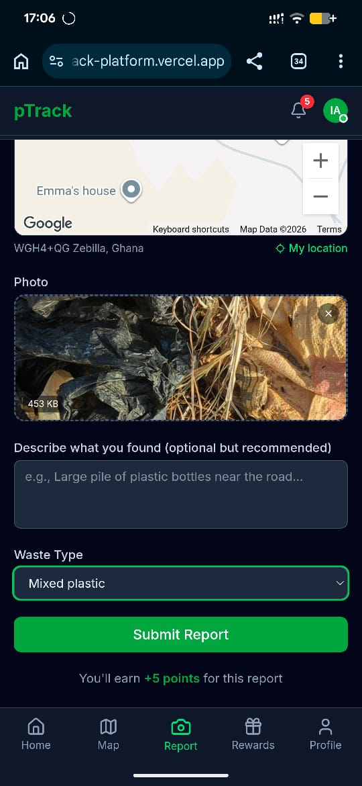</td>
    <td>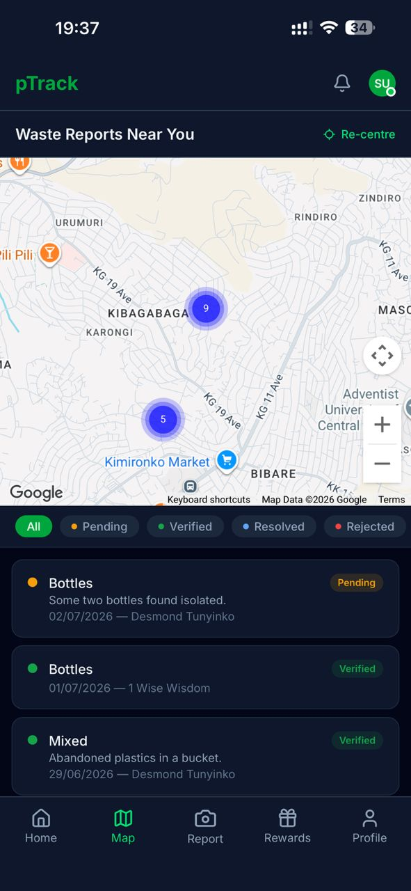</td>
    <td>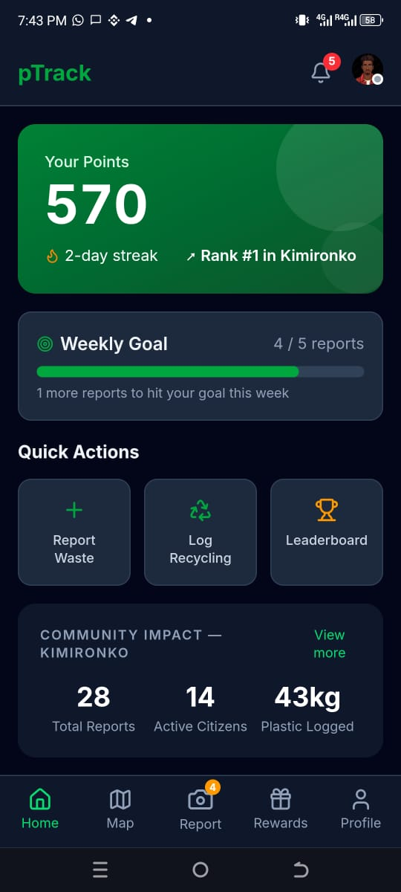</td>
  </tr>
  <tr>
    <td align="center">Waste report submission</td>
    <td align="center">Interactive waste report map</td>
    <td align="center">PWA offline mode (queued report)</td>
  </tr>
</table>

<table>
  <tr>
    <td>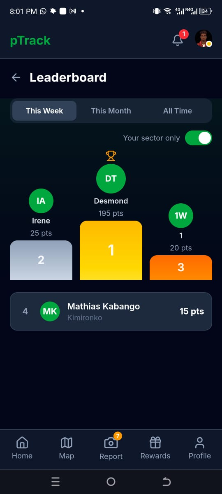</td>
    <td>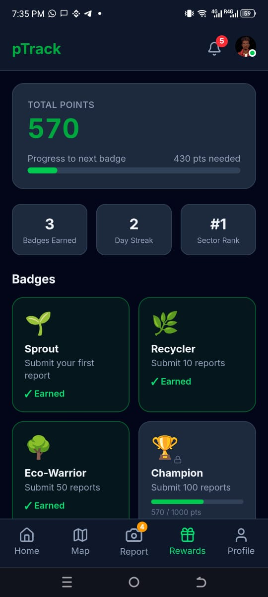</td>
    <td>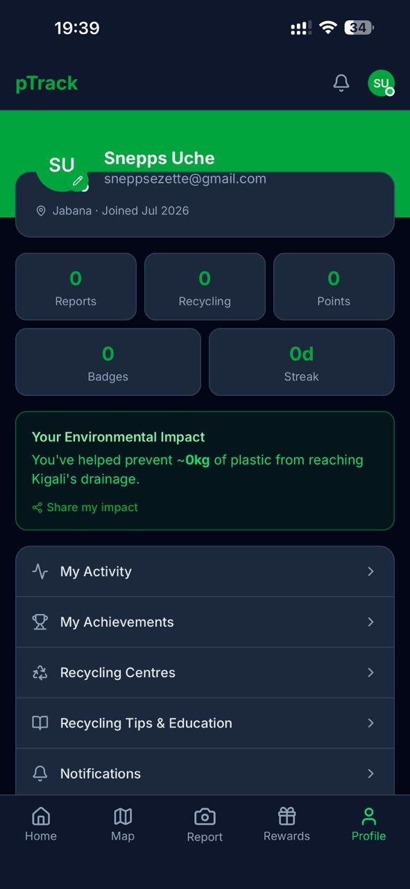</td>
  </tr>
  <tr>
    <td align="center">Community leaderboard</td>
    <td align="center">Badges and rewards</td>
    <td align="center">User profile</td>
  </tr>
</table>

### Admin Interface (Desktop)

<table>
  <tr>
    <td>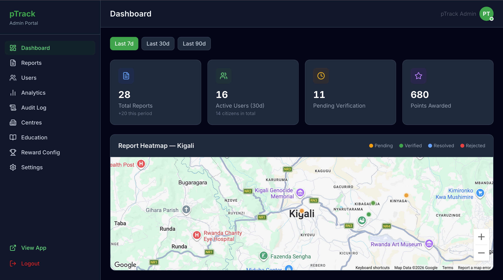</td>
    <td>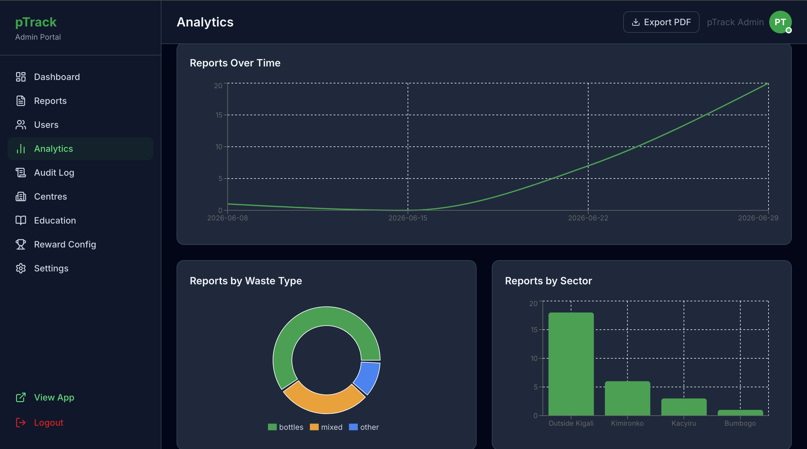</td>
  </tr>
  <tr>
    <td align="center">Admin dashboard — KPI cards and report management</td>
    <td align="center">Admin analytics — charts and engagement funnel</td>
  </tr>
</table>

---

## 11. Load Testing (Locust)

**Tool:** Locust 2.46.x (Python)
**Target:** Production backend — `https://ptrack-platform.onrender.com`
**File:** `backend/locustfile.py`

`PTrackUser` logs in once (`on_start`) with a real test account, then repeatedly fires the four highest-traffic authenticated endpoints at the weighted ratios below. Report submissions use a tiny (~632 byte) test JPEG and are labelled `"Load test report — safe to delete"` so they're easy to identify and clean up; the backend's Gemini LRU cache (keyed by image MD5) means only the first submission per run actually calls the AI service.

| Task | Endpoint | Weight |
|---|---|---|
| List reports | `GET /api/v1/reports/` | 3 |
| Leaderboard | `GET /api/v1/leaderboard/` | 2 |
| Notifications inbox | `GET /api/v1/notifications/` | 1 |
| Submit report | `POST /api/v1/reports/` (image + AI validation path) | 1 |

A `201` or a `400 invalid_image` (Gemini correctly rejecting the test image as non-waste) both count as success for `submit_report` — either outcome proves the endpoint and the AI path executed correctly.

### Prerequisites

Add real credentials for a test account to `backend/.env` (gitignored — never commit real values):

```bash
LOCUST_EMAIL=your-ptrack-account@example.com
LOCUST_PASSWORD=your-ptrack-password
```

### Running locally — headless (scripted / CI-style)

Runs to completion with no UI and prints a summary table to the terminal.

```bash
cd backend
locust -f locustfile.py --host=https://ptrack-platform.onrender.com \
  --headless -u 10 -r 2 -t 60s
```

`-u 10` = 10 simulated users, `-r 2` = spawn rate (users/sec), `-t 60s` = run duration.

### Running locally — Browser UI (interactive demo)

Drop `--headless` to launch Locust's web UI instead, useful for live demos or watching charts update in real time:

```bash
cd backend
locust -f locustfile.py --host=https://ptrack-platform.onrender.com
```

1. Locust starts a web server and prints something like `Starting web interface at http://0.0.0.0:8089`.
2. Open **http://localhost:8089** in a browser (works the same as `0.0.0.0:8089`).
3. On the "New test" screen, set:
   - **Number of users (peak concurrency):** e.g. `10`
   - **Ramp up (users started/second):** e.g. `2`
   - **Host:** pre-filled from `--host`, but editable — confirm it reads `https://ptrack-platform.onrender.com`
4. Click **Start**. The UI streams live charts (RPS, response times, number of users) and a per-endpoint stats table with request/failure counts.
5. Click **Stop** to end the run early, or let it run indefinitely until stopped (no `-t` was passed).
6. Optional: the **Download Data** tab exports the run as CSV; the **Charts** tab can be saved as a report snapshot for evidence screenshots.

To stop the process entirely, `Ctrl+C` in the terminal running `locust`.

### Results

**Headless run — 2026-08-09** (`-u 10 -r 2 -t 60s` against production):

| Endpoint | Requests | Failures | Median | Avg | Max |
|---|---|---|---|---|---|
| `POST /api/v1/auth/login/` | 10 | 0 | 11.0 s | 12.8 s | 22.2 s |
| `GET /api/v1/leaderboard/` | 16 | 0 | 4.2 s | 4.8 s | 12.1 s |
| `GET /api/v1/notifications/` | 6 | 0 | 4.0 s | 6.8 s | 15.1 s |
| `GET /api/v1/reports/` | 21 | 0 | 4.8 s | 7.5 s | 20.8 s |
| `POST /api/v1/reports/` (AI path) | 9 | 0 | 4.4 s | 5.9 s | 19.1 s |
| **Aggregated** | **62** | **0 (0.00%)** | **4.7 s** | **7.4 s** | **22.2 s** |

0 failures at 10 concurrent users, consistent with the earlier 5-user smoke test. Response times are elevated and long-tailed (login up to 22 s) — expected on Render's free tier given the 2-worker Gunicorn pool, Neon serverless database, and cold-start effects on first contact, rather than an error condition.

**Browser-UI run — 2026-08-09** (same `-u 10 -r 2 -t 60s` configuration, run interactively at `http://localhost:8089`):

| Endpoint | Requests | Failures | Failure cause |
|---|---|---|---|
| `POST /api/v1/auth/login/` | 10 | 1 | `429` — per-IP login throttle |
| `GET /api/v1/leaderboard/` | 19 | 4 | `401 Unauthorized` (downstream of the failed login, below) |
| `GET /api/v1/notifications/` | 14 | 1 | `401 Unauthorized` (downstream of the failed login, below) |
| `GET /api/v1/reports/` | 25 | 1 | `401 Unauthorized` (downstream of the failed login, below) |
| `POST /api/v1/reports/` | 8 | 6 | 5× `429` (per-user submit throttle) + 1× `401` |
| **Aggregated** | **76** | **13 (17%)** | |

**Root cause — diagnosed.** All 13 failures trace back to two throttle rules already built into the backend's abuse-protection layer (`backend/accounts/throttles.py`) — this is the app's rate limiting doing its job under synthetic load, not a defect:

1. **Login throttle (`AuthThrottle`, 5 requests/minute per IP).** All 10 simulated users run from the same machine and the same IP, ramping up within a few seconds of each other. Once the 6th `on_start` login lands inside the same rolling minute, the backend correctly throttles it: `429 {"detail": "Request was throttled. Expected available in 39 seconds."}`. `locustfile.py`'s `on_start` sets `self.token = None` on any non-200 login response, so that one simulated user then sends every subsequent request for the rest of the 60 s run with no `Authorization` header — which is why a single throttled login cascades into 7 separate `401 Unauthorized` failures spread across the leaderboard, notifications, reports-list, and one report-submit call (one user's several task cycles over the run).
2. **Report-submit throttle (`ReportSubmitThrottle`, 10 submissions/hour per authenticated user).** `locustfile.py` logs every simulated user in with the *same* single test account (`LOCUST_EMAIL`/`LOCUST_PASSWORD`), so this per-user quota is shared across the whole 10-user swarm instead of being 10-per-simulated-user. Combined with quota already spent by the headless run minutes earlier in the same rolling hour, the account hit its cap quickly, and the remaining `submit_report` calls correctly received `429 {"detail": "Report submission rate limit exceeded. Try again later."}`.

Both throttles behaved exactly as designed — `AuthThrottle` is brute-force protection on the login endpoint, and `ReportSubmitThrottle` is the anti-spam control that complements the fraud detector's own "high velocity" flag (`backend/reports/fraud_detector.py`, >5 reports/hour), except the throttle hard-rejects at 10/hour while the fraud detector only flags for admin review. The 17% "failure" rate is an artefact of the load test authenticating every simulated user as one shared identity at high concurrency — a real deployment has each citizen on their own account, so neither throttle would collapse onto a single quota the way it does here. **For a more representative future run:** seed N distinct test accounts (one per simulated user, e.g. via a `manage.py` fixture) so the login and submit-report throttles are exercised per-user instead of pooling onto one identity.

The primary bottleneck at higher concurrency will be the Gunicorn worker pool (2 workers on the current Render free tier) and the Neon database connection pool. If throughput constraints emerge, the first remediation should be increasing the Gunicorn worker count (via the `--workers` flag in `render.yaml`) and enabling database connection pooling via PgBouncer (available on Neon).

---

## 12. Summary

| Strategy | Status |
|---|---|
| Backend unit + integration tests (106) | Passing in CI |
| Frontend unit tests (31) | Passing in CI |
| E2E browser tests (8, Chromium) | Passing in CI |
| TypeScript / mypy type checking | Passing in CI |
| ESLint / Ruff linting | Passing in CI |
| Black / Prettier formatting | Passing in CI |
| Gitleaks secret scan | No findings |
| Production uptime (UptimeRobot) | 100% (backend + frontend) |
| Sentry error monitoring | Active, zero unresolved errors |
| Cross-device testing (5+ device types) | All pass |
| Offline PWA (IndexedDB + background sync) | Verified on Android, iPhone, and MacBook |
| Load testing (Locust, headless) | 0 failures at 10 concurrent users (62 reqs) |
| Load testing (Locust, browser UI) | 13/76 (17%) failures — traced to login/submit throttling on a shared test account, not a defect; see §11 |

All automated checks pass on every commit to `main`. The live deployment at `https://ptrack-platform.vercel.app` has been manually verified to match the expected behaviour described in this report.